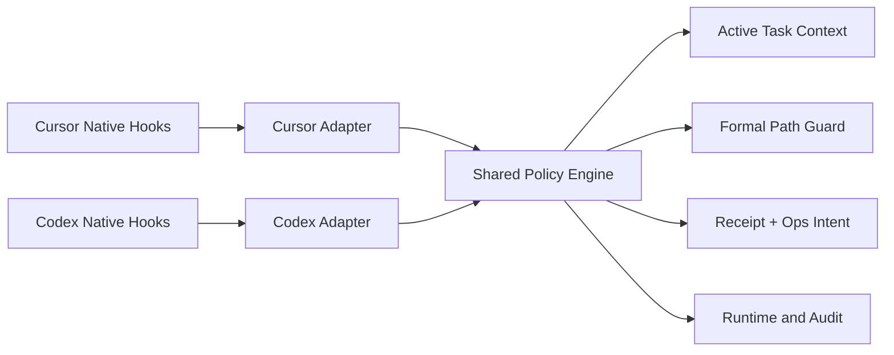

---worktrail
{
  "schema": "worktrail.knowledge.v1",
  "id": "cursor-codex-local-hooks-architecture",
  "scope": "project",
  "type": "architecture",
  "title": "Cursor 与 Codex 本地 Hooks 集成架构",
  "status": "active",
  "lifecycle": "current",
  "topic": "agent-integrations"
}
---

# Cursor 与 Codex 本地 Hooks 集成架构

## 1. 背景与目标

Worktrail 当前的 Hook 实现混合宿主协议、使用旧 Codex scalar 配置、可能覆盖用户 hooks，且 `init` 与 `install` 都可能写项目 Hooks。当前通用 `Result` 输出不能表达宿主原生的 context、permission 与阻断语义；payload 还可能暴露 transcript 路径或原始工具材料。

本架构以 Worktrail CLI 为唯一执行与知识真源，通过项目级 Cursor/Codex Hooks 提供：

- 唯一显式 active task 的有界 context 注入；
- 对可事前判断的正式知识写入执行 guard；
- checkpoint、terminal、validation 等 runtime effect 的幂等与审计；
- 保留用户 hooks 的 install、doctor、uninstall 配置协调。

## 2. 边界与约束

- 仅支持当前 Cursor/Codex 原生 Hooks schema；不保留旧 schema 运行兼容。
- Hook 配置直接执行 `worktrail hook <host> <event>`；不生成 runner、wrapper、manifest、私有二进制路径或平台专用脚本。
- 不实现 Plugin、Cloud Agent、后台服务、MCP server、自动 handoff/promotion，也不修改显式 state。
- Hooks 不持久化完整 prompt、thought、transcript、原始工具输入/输出或绝对 transcript 路径。
- Cursor 对文件编辑仅有 `afterFileEdit`：该路径只能事后审计，不能作为事前阻断点。Shell/MCP 仍可在对应 before hook 中事前 guard。

## 3. 方案选择

采用“共享策略内核 + 宿主协议适配器”：adapter 只处理宿主输入、输出与退出码；共享内核只处理 task 解析、路径策略、effect planning、receipt 和审计。相较通用 handler，此方案可以逐事件 golden 测试而不复制业务规则；相较 Plugin 或后台服务，不引入额外分发、网络或信任模型。

## 4. 组件与职责

### 4.1 配置协调器

- `DesiredSpec` 定义每宿主事件、matcher、command、timeout 与 contract version。
- managed handler identity 为 `host + event + worktrail-hook-command + contract-version`。
- Cursor 在 event array 中 upsert；Codex 在 event → matcher group → handler 中 upsert。
- 保留用户根字段、matcher、handler 和相对顺序；malformed JSON 报错而不覆盖。
- 旧 Worktrail Codex scalar 可升级为 matcher group；任一非 Worktrail scalar 返回 `legacy_codex_user_hook_requires_manual_migration`，整个 project install 零写入。
- `init` 仅初始化 Worktrail 根与 `.gitignore`；仅 `install --project` 写项目 hooks。

### 4.2 宿主协议适配器

`NormalizedHookEvent` 至少包含 host、native event、project root、配置读取的 project ID、session/turn 标识、tool/use 标识、allowlisted 输入与时间。payload 的 `project_id` 只做一致性诊断。

`HookDecision` 是内部模型，包含 allow/deny/defer、reason code、用户/agent message、context 与 effects；禁止直接将其作为 stdout wire。每个宿主、每个事件使用独立 encoder。

### 4.3 Receipt 与 effect

Receipt 使用 `.worktrail/ops/hook-receipts/sha256(effect-key).json`，目录 `0700`、文件 `0600`，状态为 `claimed|completed`。claim、runtime/checkpoint、事件日志与 complete 必须在同一 ops intent 内；重复 claim 不执行 effect。pending intent 仅能由 `worktrail doctor ops repair --confirm` 修复，hook 不自动 replay。completed receipt 最少保留 30 天，清理由显式 prune 执行。

Hooks 只写 runtime、receipt、binding 与 reason-code 审计；永不创建 takeover、handoff、candidate 或正式知识。

## 5. 宿主协议矩阵

### 5.1 Cursor

Cursor 使用 version 1 event array，配置 command 是直接的 `worktrail hook cursor <event>`。guard timeout 为 1 秒，其他 handler 为 2 秒。

| Cursor event | 作用 | 输出与退出码 |
|---|---|---|
| `sessionStart` | 建立 binding，并在唯一 task 时注入 context | `{"additional_context":"..."}` 或 `{}`，exit 0 |
| `beforeShellExecution` | Shell 正式路径 guard | allow/ask/deny permission JSON；deny exit 2 |
| `beforeMCPExecution` | MCP 正式路径 guard | allow/ask/deny permission JSON；deny exit 2 |
| `afterShellExecution` | validation/runtime 审计 | 有效 no-op，exit 0 |
| `afterMCPExecution` | validation/runtime 审计 | 有效 no-op，exit 0 |
| `afterFileEdit` | 正式路径编辑事后审计 | 有效 no-op，exit 0；绝不声称阻止已完成写入 |
| `preCompact` | checkpoint | 有效 no-op，exit 0 |
| `stop` | terminal effect | 有效 no-op，exit 0 |
| `sessionEnd` | 清 binding 与审计 | 有效 no-op，exit 0 |

Cursor deny JSON 使用 `permission`、`user_message`、`agent_message`。已捕获的解析/策略错误必须编码为 allow/no-op JSON 并 exit 0；仅 stdout 无法写出等进程级故障以非 0/2 退出，依赖 Cursor 的 fail-open 语义。

### 5.2 Codex

Codex 使用 event → matcher group → command handler schema，handler 类型 `command`；guard timeout 1 秒，其余 2 秒。首期明确注册九个事件，**不注册 `SubagentStart`**，因为没有对应 effect。

| Codex event | 作用 |
|---|---|
| `SessionStart` | binding；以 `hookSpecificOutput{hookEventName:"SessionStart",additionalContext}` 注入 context |
| `UserPromptSubmit` | 首次、state revision 变化或 compact 后，以对应 `hookSpecificOutput` 注入 context |
| `PreToolUse` | 可判定工具写入的事前 guard；deny 输出 `{"permissionDecision":"deny","block":true,"hookSpecificOutput":{}}` 并 exit 2 |
| `PermissionRequest` | policy deny 时输出 `hookSpecificOutput{hookEventName:"PermissionRequest",decision:{behavior:"deny",message:"..."}}` 并 exit 0；其他情况 defer 给正常审批 |
| `PostToolUse` | validation/runtime 审计，不保存原始工具输出 |
| `PreCompact` | checkpoint |
| `PostCompact` | 关闭 compact receipt，标记 context refresh |
| `SubagentStop` | 有界、脱敏摘要 |
| `Stop` | 幂等 terminal runtime；不请求自动继续 |

`SessionStart`、`UserPromptSubmit`、`PreToolUse` 与 `PermissionRequest` 必须各自有官方 schema 对应的 golden fixture；不得将一个事件的字段复用于另一个事件。PreToolUse 的阻断由 exit 2 表示；PermissionRequest 的阻断由 decision wire 表示并保持 exit 0。已捕获错误返回事件有效 no-op JSON 并 exit 0。进程级写出失败的 Codex 行为必须在目标 CLI 版本 fixture smoke 中验证，Worktrail 不依赖其推断的 fail-open 语义。

## 6. Active Task Context

仅当项目恰有一个带非空 `task_id` 的显式 active state 时建立或刷新 binding；0 个、多于 1 个、state 已关闭、非显式或 task 为空均不注入并删除 binding。禁止从 prompt、runtime、handoff 或 candidate 推测 task。

binding 位于 `.worktrail/runtime/hooks/bindings/<host>-<session-hash>.json`，权限 `0600`，保存 host、session hash、state ID、task ID、state revision、last injected revision 与 last seen time。Cursor `sessionEnd` 删除 binding；Codex `SessionStart(clear)` 建新 binding；24 小时闲置由显式 prune 清理；Codex `PostCompact` 清空注入 revision。

context 最大 6144 字节，仅含 project ID、task ID、当前目标、关键约束、最新显式决策、下一步与最多三个仓库相对引用；不得包含绝对路径、完整知识正文、secret 或 transcript。

## 7. 正式知识路径保护

路径判断复用 `knowledge.IsFormalKnowledgePath`。API 输入先规范化为项目内 Worktrail 知识相对路径；对已有目标或父目录中的符号链接，解析后的目标若落入正式知识根则按正式路径阻断。解析失败、根外或逃逸项目根的路径不阻断，但写 reason-code 审计。

可事前阻断的范围仅包括 Cursor `beforeShellExecution`/`beforeMCPExecution` 与 Codex `PreToolUse`/`PermissionRequest` 中可确定解析的写入：

- Shell 的单一文字目标 `>`、`>>`、`tee`、`cp`、`mv`、`rm`；
- 带明确 `path` 或 `file_path` 的写型 MCP；
- Codex 的 file edit/apply patch 请求中明确的单一文件路径。

变量、命令替换、glob、管道、多命令、非文字重定向目标和未知写入 shape 仅审计。Cursor `afterFileEdit` 也仅审计。允许读操作和经精确命令名识别的 `worktrail draft|adr|review` 受控流程。这不是安全沙箱；CLI 内部校验与 candidate/review 边界仍是权威防线。

## 8. 事件 effect 与幂等

- Cursor `preCompact` 写 checkpoint，`stop` 以 `project + host + session + generation + terminal` 幂等写 terminal runtime，`sessionEnd` 仅清 binding。
- Codex `PreCompact` 写 checkpoint，`PostCompact` 刷新 binding，`Stop` 以 `project + host + session + turn + terminal` 幂等写 terminal runtime，`SubagentStop` 仅写脱敏摘要。
- validation key 为 `host + tool_use_id + validation`；context key 为 `session + task_id + state_revision + context`。

## 9. 安装、Doctor、回退与隐私

`install --user` 仅安装 Rules、AGENTS、Skills；`install --project` 在完整 preflight 后安装项目 Rules/Skills 并原子 replace hooks 配置。若 hooks replace 失败，原 hooks 不变，report 必须说明 Rules/Skills 已完成、hooks 未安装且可重试。Uninstall 仅移除 Worktrail managed handler 与空 matcher group，保留用户配置。

Doctor 检查 schema、matcher、timeout、managed handler 缺失/重复、legacy scalar、project ID 一致性、binding/receipt 权限及过期记录、pending ops intent 与 Codex `/hooks` trust；不检查 runner 资产。

审计只保存 event、effect、decision、reason code、延迟、dedupe 状态和非敏感 host/session/task hash。若协议或宿主不兼容，卸载 Worktrail managed handler 即可回退，不影响正式知识或 Handoff V2。

## 10. 验收条件

1. 用户 hooks 保留；非 Worktrail Codex scalar 不改写且整个 project install 零写入。
2. 重复安装不创建重复 handler；Codex handler 都有显式 timeout。
3. `init` 不隐式写 hooks。
4. Cursor/Codex 每个已注册事件都有输入/输出 golden；Cursor/PreToolUse deny 的 JSON 与 exit 2、PermissionRequest deny 的 decision wire 与 exit 0 均经过断言。
5. 只有唯一显式 active task 注入不超过 6144 字节的 context。
6. Shell/MCP 的支持写入形态事前阻断；复杂形态与 Cursor 文件编辑仅审计。
7. 合法受控 Worktrail CLI 不被阻断。
8. terminal/checkpoint/validation/context effect 幂等；hook 不创建 takeover、handoff、candidate 或正式知识。
9. runtime、receipt、审计不含 secret、原始 prompt/tool output 或绝对 transcript 路径。
10. Doctor 能发现旧 schema、重复 handler、legacy scalar、未决操作和 Codex 待信任状态。
11. 配置 round-trip、协议 golden、并发幂等、targeted failure 语义、全量与 race 验证通过。

## 11. Residual Assumptions

- **assumption**：Codex 对无法写 stdout 的进程级 hook 故障在不同 CLI 版本中可能具有不同降级语义。
  **validation_method**：将目标 Codex CLI 版本写入 protocol fixture metadata，并在发布前以该版本运行 command-hook smoke；若其行为不符合 no-op/fail-open 预期，则禁止发布并更新 adapter contract。

## 12. 影响范围与 ADR

影响 `templates/config/*hooks.json`、`internal/hooks`、`internal/integrations`、`internal/store/init.go`、`internal/runtime`、`internal/ops`、state/context resolver、Doctor、手册和对应测试。

ADR-HK-001 至 ADR-HK-005 仍为 Proposed，不作为已接受 ADR 约束；本架构记录它们的实现方向：最新 schema、共享策略内核、用户级 Rules/Skills + 项目级 Hooks、唯一显式 active task 与终止事件语义分工。
